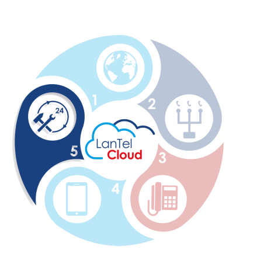

# :wave_tone2: Welkom!

{ align=right }{ width="300" }
Welkom op onze selfservice portal!
Heb je een vraag over het gebruikt van jouw telefonieomgeving? Alle handige informatie en handleidingen voor jou als gebruiker van onze LanTel Cloud diensten vind je hier. Ook dat is de service van LanTel!

## Categorien

Hieronder vind je alle categoriën van onze Selfservice.

-   :material-headset:{ .lg .middle } __(Draadloze) headsets__
    
    ---
    
    Alles over het gebruik van `(draadloze) headsets`
    
    [:octicons-arrow-right-24: Klik voor meer info](/docs-lantelcloud/(Draadloze) Headsets/)

-   :information_source:{ .lg .middle } __Algemene informatie LanTel Cloud diensten__
   
    ---
   
    Focus on your content and generate a responsive and searchable static site
    
    [:octicons-arrow-right-24: Klik voor meer info](/docs-lantelcloud/Algemene informatie LanTel Cloud diensten/)

-   :material-human-queue:{ .lg .middle } __Aurora TeleQ__
    
    ---
    
    Change the colors, fonts, language, icons, logo and more with a few lines
    
    [:octicons-arrow-right-24: Klik voor meer info](/docs-lantelcloud/Aurora TeleQ/)

-   :computer:{ .lg .middle } __CloudCTI__
    
    ---
    
    Material for MkDocs is licensed under MIT and available on [GitHub]
    
    [:octicons-arrow-right-24: Klik voor meer info](/docs-lantelcloud/CloudCTI/)

-   :fax:{ .lg .middle } __E-Fax__
   
    ---
   
    Material for MkDocs is licensed under MIT and available on [GitHub]
    
    [:octicons-arrow-right-24: Klik voor meer info](/docs-lantelcloud/E-Fax/)

-   :telephone_receiver:{ .lg .middle } __LanTel Blue - Univerge Blue__
    
    ---
    
    Material for MkDocs is licensed under MIT and available on [GitHub]
    
    [:octicons-arrow-right-24: Klik voor meer info](/docs-lantelcloud/LanTel Blue - Univerge Blue/)

-   :mobile_phone:{ .lg .middle } __LanTel Mobiel__
   
    ---
   
    Material for MkDocs is licensed under MIT and available on [GitHub]
    
    [:octicons-arrow-right-24: Klik voor meer info](/docs-lantelcloud/LanTel Mobiel/)

-   :telephone:{ .lg .middle } __LanTel Move - Avaya__
    
    ---
    
    Material for MkDocs is licensed under MIT and available on [GitHub]
    
    [:octicons-arrow-right-24: Klik voor meer info](/docs-lantelcloud/LanTel Move - Avaya/)

-   :simple-microsoftteams:{ .lg .middle } __LanTel Teams Bellen__
   
    ---
   
    Material for MkDocs is licensed under MIT and available on [GitHub]
    
    [:octicons-arrow-right-24: Klik voor meer info](/docs-lantelcloud/LanTel Teams Bellen/)

-   :telephone_receiver:{ .lg .middle } __LanTel Wave - Coligo/Enreach Contact__
    
    ---
    
    Material for MkDocs is licensed under MIT and available on [GitHub]
    
    [:octicons-arrow-right-24: Klik voor meer info](/docs-lantelcloud/LanTel Wave - Coligo/Enreach Contact/)

!!! tip

    Gebruik de zoekfunctie om snel jou informatie te vinden!

Niet gevonden wat je zoekt? Neem contact op met onze afdeling 'klantenservice'.
Dit kan eenvoudig per mail: [servicedesk@lantel.nl](mailto:servicedesk@lantel.nl), per telefoon: [078 630 55 55](tel:078 630 55 55) of stuur ons eenvoudig een whatsapp berichtje: [078 630 55 55](https://wa.me/+31786305555).

